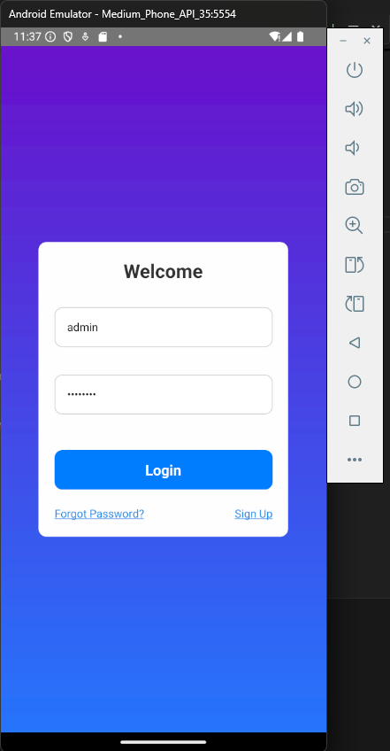
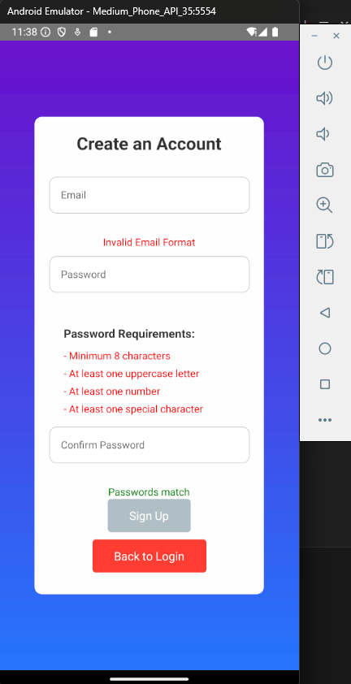
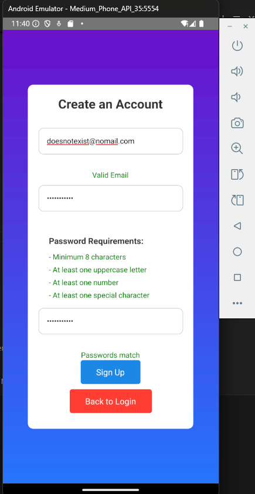
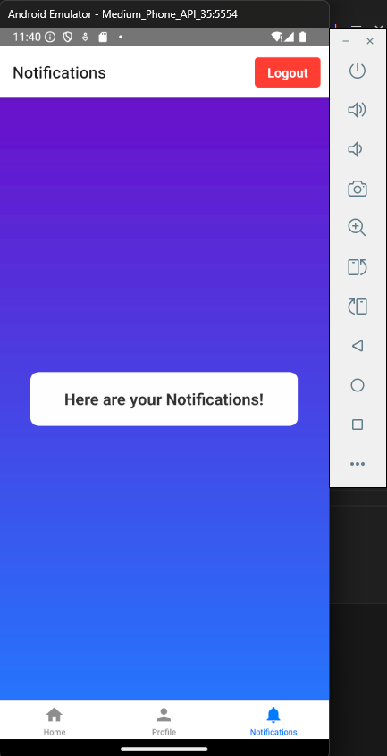
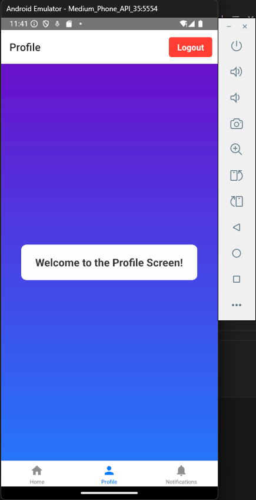

This is a new [**React Native**](https://reactnative.dev) project, bootstrapped using [`@react-native-community/cli`](https://github.com/react-native-community/cli).

# Day 2 Assignment

## Problem Statement
Create a mobile application with login, signup, and profile functionality, offering seamless navigation and a visually appealing user interface.

## Features
- **Login Screen:** User authentication with username and password.
- **Signup Screen:** New user registration with a back-to-login option.
- **Forgot Password Screen:** Prompt for password recovery with navigation back to login.
- **Navigation Bar:** To navigate between 3 pages, Home, User, and Notifications.

## Approach
1. Implemented navigation using React Navigation to manage screens.
2. Used React Native components and libraries like `react-native-linear-gradient` for styling.
3. Focused on responsive design and intuitive UI elements.

## Execution
- **Screens:**
  - Login: Validates user credentials.
  - Signup: Allows new users to register.
  - Forgot Password: Guides users to reset their passwords.
  - Profile: Displays user details with a logout button.
- **Navigation:** Stack navigation to handle screen transitions smoothly.
- **Styling:** Consistent and modern design using custom styles and gradients.

## Requirements
- Node.js
- React Native CLI or Expo CLI
- Dependencies: 
  - `@react-navigation/native`
  - `@react-navigation/stack`
  - `react-native-linear-gradient`
  - `react-native-vector-icons`

## Installation
1. Clone the repository:
   ```bash
   git clone <repository-url>
   ```
2. Install dependencies:
   ```bash
   npm install
   ```
3. Start the development server:
   ```bash
   npx react-native run-android
   # or
   npx react-native run-ios
   ```

## Usage
1. Launch the app on your emulator or connected device.
2. Navigate through login, signup, and profile screens.
3. Use the "Forgot Password" option if needed.
4. Logout from the profile screen to return to login.

## Project Structure
```
project_directory/
|-- screens/
|   |-- LoginScreen.tsx
|   |-- SignupScreen.tsx
|   |-- ForgotPasswordScreen.tsx
|   |-- DynamicScreen.tsx
|   |-- MainTabs.tsx
|-- styles/
|   |-- commonStyles.ts
|-- App.tsx
|-- Navigation.tsx
```

## Relevant Screenshots
1. Login Screen



2. Sign up



Once you enter the proper credentials, you can successfully sign up



3. Home page


4. Notifications Page



5. Profile Page



If you can't get this to work, see the [Troubleshooting](https://reactnative.dev/docs/troubleshooting) page.

# Learn More

To learn more about React Native, take a look at the following resources:

- [React Native Website](https://reactnative.dev) - learn more about React Native.
- [Getting Started](https://reactnative.dev/docs/environment-setup) - an **overview** of React Native and how setup your environment.
- [Learn the Basics](https://reactnative.dev/docs/getting-started) - a **guided tour** of the React Native **basics**.
- [Blog](https://reactnative.dev/blog) - read the latest official React Native **Blog** posts.
- [`@facebook/react-native`](https://github.com/facebook/react-native) - the Open Source; GitHub **repository** for React Native.
